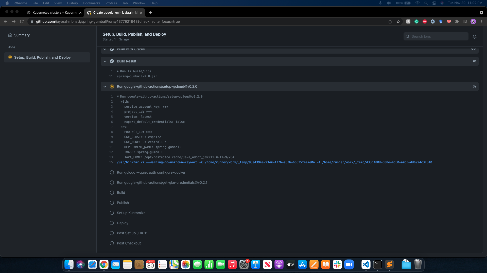

# spring-gumball ci/cd example

## CI Workflow

- Below is a image of the GitHub Actions workflow for Continuous Integration.
- 
- 
- 

## CD Workflow

- Below are sequential steps that I followed to test CD portion of the project.
  
  
  
  
  
  
  
  
  
  
  
  
  
  
  
